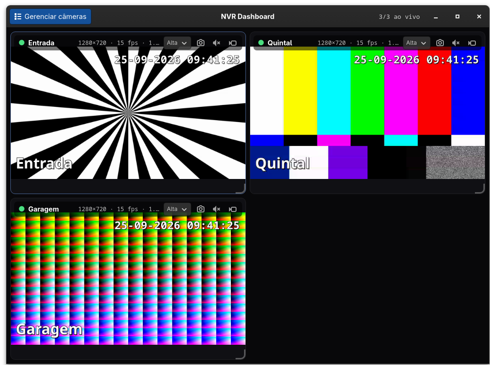
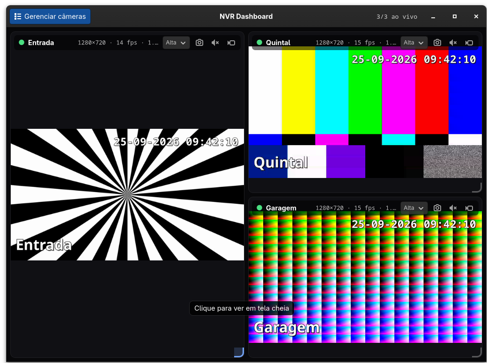
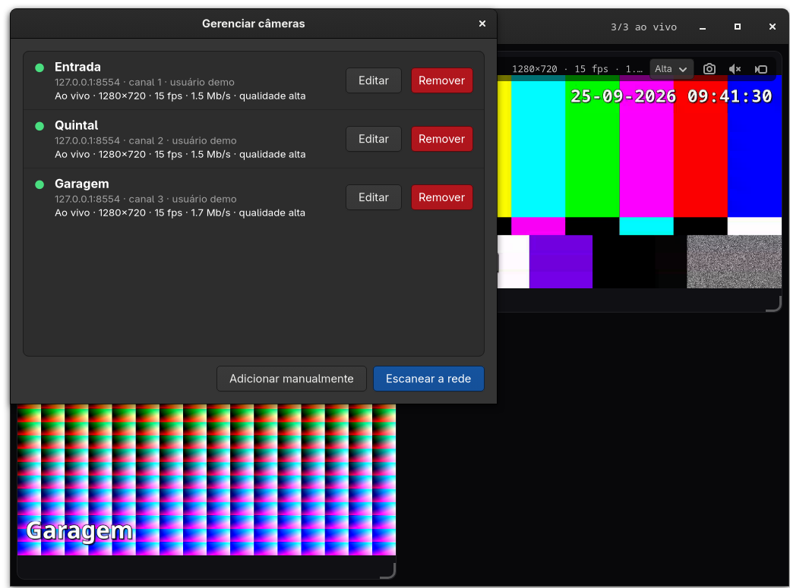
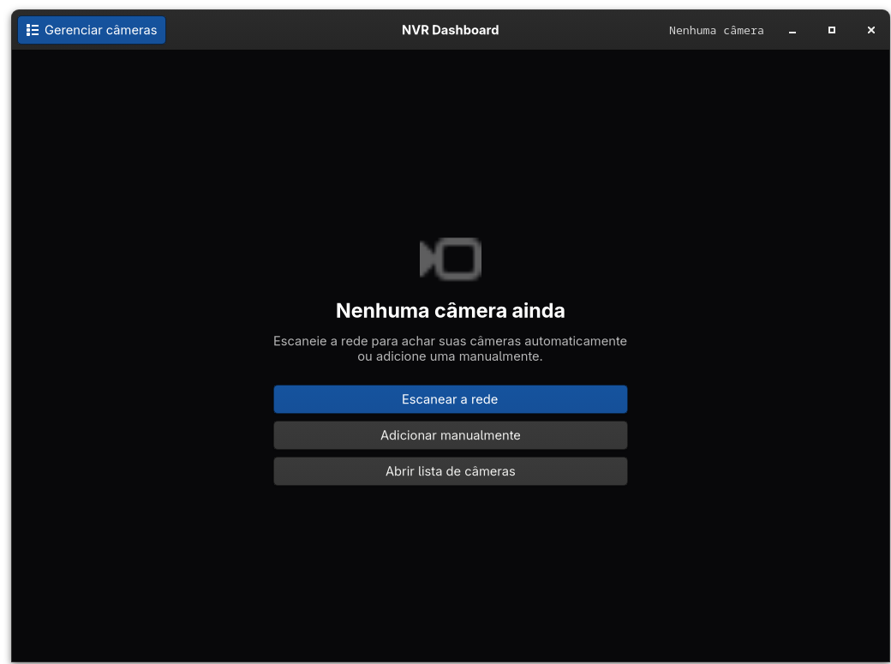

# nvr-dashboard

Dashboard nativo para Linux (Rust + GTK4 + GStreamer) que mostra ao vivo, num
grid, as câmeras de um NVR iCSee/XMEye (firmware Hi3520) ou câmeras IP via
RTSP. As câmeras são cadastradas pela própria janela — manualmente ou
**escaneando a rede** — e o app cuida de reconexão automática, captura de tela,
gravação sob demanda, áudio, detecção de movimento e ícone na bandeja.



_Imagens deste README usam vídeo sintético (padrões de teste do GStreamer
servidos por [`tools/fake_rtsp.py`](tools/fake_rtsp.py)), não câmeras reais._

<table>
  <tr>
    <td width="50%"><br><sub><b>Layout livre:</b> cada card tem tamanho próprio; o invadido vai para o espaço livre.</sub></td>
    <td width="50%"><br><sub><b>Gerenciar câmeras:</b> dados ao vivo, editar, remover, adicionar, escanear.</sub></td>
  </tr>
</table>

---

## Início rápido

```sh
sudo pacman -S --needed rustup gtk4 gstreamer gst-plugins-base gst-plugins-good \
                        gst-plugins-bad gst-plugins-ugly gst-libav gst-plugin-gtk4
rustup default stable
cargo run --release
```

_(Arch/CachyOS. No **Ubuntu 24.04**, rode antes `tools/setup-ubuntu.sh` — veja
[Ubuntu 24.04 e Debian](#ubuntu-2404-e-debian).)_

1. O app abre **sem câmeras**, com o botão **Escanear a rede** (e **Adicionar
   manualmente**).
2. No dispositivo encontrado, clique em **Adicionar…**, informe usuário e senha e
   use **Detectar canais** — só os canais com imagem ficam marcados.
3. Pronto: cada canal vira um card. Arraste as bordas para redimensionar, o card
   para reorganizar, e clique num card para abrir em tela cheia.

Tudo isso é salvo entre execuções. Detalhes nas seções abaixo.

---

## Sumário

- [Recursos](#recursos)
- [Requisitos](#requisitos)
- [Instalação](#instalação)
- [Configuração](#configuração)
- [Uso](#uso)
- [Arquitetura](#arquitetura)
- [Segurança](#segurança)
- [Problemas conhecidos](#problemas-conhecidos)
- [Diagnóstico](#diagnóstico)
- [Desenvolvimento](#desenvolvimento)

---

## Recursos

**Cadastro de câmeras**

- Abre **vazio** na primeira execução, com botões para escanear a rede ou adicionar manualmente
- Escaneia a sub-rede (porta RTSP 554 + ONVIF/WS-Discovery) e lista o que encontrar
- "Detectar canais" testa os canais 1–8 do dispositivo e marca só os que têm imagem
- **Gerenciar câmeras** (barra de título): lista com dados ao vivo, editar, adicionar e remover, sem reiniciar o app

**Visualização**

- Grid em células: cada card tem **tamanho próprio** (arraste a borda ou o canto), reordena arrastando o card, e quem é invadido é realocado para o espaço livre; layout salvo entre execuções
- Uma pipeline GStreamer independente por câmera — uma câmera offline não afeta as outras
- Clique (ou tecla `1`–`9`) abre a câmera em tela cheia; `Esc` volta ao grid
- Status por card: conectando / ao vivo / reconectando / falha, com resolução, fps e bitrate de rede
- Seletor de **qualidade** por câmera (principal / substream) e `adaptive_stream` para poupar CPU e banda

**Áudio**

- Botão de alto-falante em cada card: ouve o som que o NVR já envia pelo RTSP (uma câmera por vez; só consome quando ligado)

**Confiabilidade**

- Reconexão automática com backoff exponencial (2 s, 4 s, 8 s… até o teto), que zera quando o vídeo volta
- Watchdog de quadros: reinicia a pipeline se a câmera "congelar" sem emitir erro
- Health-check TCP do NVR, que distingue "câmera com problema" de "NVR fora do ar"
- Um erro de áudio ou de gravação nunca derruba o vídeo ao vivo
- Log estruturado de todos os eventos de pipeline

**Captura e gravação**

- Captura do quadro atual em PNG, na resolução nativa do vídeo
- Gravação sob demanda em MKV/MP4, **sem recodificar** e sem abrir uma segunda conexão RTSP
- Buffer circular via `splitmuxsink` (`segment_seconds` × `max_files`)

**Automação**

- Detecção de movimento por diferença de quadros, com sensibilidade e cooldown configuráveis
- Notificações do desktop quando uma câmera cai e quando volta
- Ícone na bandeja (StatusNotifierItem) com resumo e menu
- Vários NVRs / câmeras IP no mesmo dashboard

**Ainda não suportado:** PTZ (mover/zoom) e interfone (falar pela câmera). Veja
[Problemas conhecidos](#ptz-e-interfone-não-suportados).

---

## Requisitos

Tudo vem dos repositórios oficiais do Arch/CachyOS:

```sh
sudo pacman -S --needed rustup gtk4 gstreamer gst-plugins-base gst-plugins-good \
                        gst-plugins-bad gst-plugins-ugly gst-libav gst-plugin-gtk4
rustup default stable
```

| Componente | Para quê | Obrigatório |
|---|---|---|
| `gtk4` ≥ 4.12 | interface | sim |
| `gstreamer` + `plugins-base/good` | RTSP, decodificação, gravação | sim |
| `gst-plugin-gtk4` | elemento `gtk4paintablesink` | sim |
| `gst-libav` | decoders de software (`avdec_h264`, `avdec_h265`) | sim |
| `gst-plugin-pipewire` ou `gst-plugins-good` (Pulse) | saída de som (`autoaudiosink`) | só para o áudio |
| `gst-plugin-va` / `nvcodec` | decodificação por hardware (opcional, ver [Problemas conhecidos](#problemas-conhecidos)) | não |
| Extensão GNOME AppIndicator | ícone na bandeja | não |
| `python3` | só o servidor RTSP de teste em `tools/` | não |

Verifique o ambiente sem compilar nada:

```sh
gst-inspect-1.0 gtk4paintablesink rtspsrc splitmuxsink parsebin >/dev/null && echo ok
```

> **Usa Ubuntu/Debian?** Veja [Ubuntu 24.04 e Debian](#ubuntu-2404-e-debian): lá o
> `gtk4paintablesink` não vem em pacote e o Rust do `apt` é antigo demais, mas há um
> script que resolve os dois.

### Ubuntu 24.04 e Debian

O comando `pacman` acima é do Arch. No Ubuntu 24.04 LTS há dois obstáculos, e **a
versão do GStreamer não é um deles**:

| Item | Ubuntu 24.04 | O projeto precisa | Solução |
|---|---|---|---|
| GStreamer | 1.24.2 | ≥ 1.14 (mínimo do sistema, exigido pelos crates `gstreamer`) | nada a fazer: **1.24 funciona** |
| GTK4 | 4.14.5 | ≥ 4.12 | nada a fazer |
| Rust (`apt`) | 1.75 | **≥ 1.92** (edition 2024 e crates `gtk4`/`gstreamer` recentes) | instalar via `rustup` |
| `gtk4paintablesink` | **sem pacote** (nem `gstreamer1.0-gtk4`) | elemento obrigatório | compilar o plugin do `gst-plugins-rs` |

> Os crates Rust `gstreamer 0.25` **não** exigem a biblioteca GStreamer 1.26: eles
> compilam contra 1.14 ou mais nova e só liberam recursos extras quando a versão
> instalada permite. O que barra o Ubuntu 24.04 são o Rust antigo e o plugin.

**Caminho suportado: o script.** Como usuário comum (ele pede `sudo` só para o `apt`):

```sh
tools/setup-ubuntu.sh          # apt + rustup + plugin gtk4paintablesink (alguns minutos)
sudo make install              # compila (como o seu usuário) e instala
```

O script: (1) instala as dependências com `apt`; (2) instala o Rust via `rustup` se
o que houver for anterior a 1.92; (3) compila **só** o `gst-plugin-gtk4` do
[`gst-plugins-rs`](https://gitlab.freedesktop.org/gstreamer/gst-plugins-rs) na
versão feita para o GStreamer 1.24 (branch `0.13`) e o instala em
`~/.local/share/gstreamer-1.0/plugins`, onde o GStreamer procura sozinho, sem
variável de ambiente; (4) confere `gtk4paintablesink`, `rtspsrc`, `splitmuxsink` e
`parsebin`. É idempotente: se o elemento já existir, não recompila. Para usar
outra versão do plugin: `GST_PLUGINS_RS_REF=<branch-ou-tag> tools/setup-ubuntu.sh`;
se você já instalou as dependências do `apt`, `NO_APT=1 tools/setup-ubuntu.sh`.

**Passo a passo manual** (o que o script faz):

```sh
sudo apt-get install -y build-essential pkg-config curl git ca-certificates \
  libgtk-4-dev libglib2.0-dev libgraphene-1.0-dev \
  libgstreamer1.0-dev libgstreamer-plugins-base1.0-dev \
  gstreamer1.0-tools gstreamer1.0-plugins-base gstreamer1.0-plugins-good \
  gstreamer1.0-plugins-bad gstreamer1.0-plugins-ugly gstreamer1.0-libav \
  gstreamer1.0-gl gstreamer1.0-pulseaudio gstreamer1.0-pipewire \
  libwayland-dev libx11-dev libegl-dev libgl-dev libdrm-dev \
  libgtk-4-bin desktop-file-utils

curl --proto '=https' --tlsv1.2 -sSf https://sh.rustup.rs | sh -s -- -y   # Rust >= 1.92

git clone --depth 1 --branch 0.13 https://gitlab.freedesktop.org/gstreamer/gst-plugins-rs.git
(cd gst-plugins-rs && cargo build --release -p gst-plugin-gtk4)
mkdir -p ~/.local/share/gstreamer-1.0/plugins
install -m755 gst-plugins-rs/target/release/libgstgtk4.so ~/.local/share/gstreamer-1.0/plugins/

gst-inspect-1.0 gtk4paintablesink            # deve listar o elemento
cargo build --release && ./target/release/nvr-dashboard
```

**O que foi testado:** num Ubuntu 24.04.5 limpo (contêiner, usuário comum com
`sudo`), o script, a compilação do app contra o GStreamer 1.24.2, `sudo make
install` (o `target/` fica do seu usuário), `nvr-dashboard --check`, o app
conectando a câmeras RTSP de teste com os quadros chegando ao
`gtk4paintablesink`, e `sudo make uninstall`. **Não foi testado** em sessão
gráfica real do Ubuntu (GNOME/Wayland), decodificação por hardware, áudio nem
bandeja. Se algo falhar aí, abra uma issue com a saída de
`gst-inspect-1.0 --version` e `RUST_LOG=nvr_dashboard=debug nvr-dashboard`.

Debian **não foi testado**. A lógica é a mesma (Rust novo e o plugin), e se a sua
versão já trouxer o pacote `gstreamer1.0-gtk4`, o script detecta o elemento e pula
a compilação do plugin.

---

## Instalação

**Rodando do diretório do projeto:**

```sh
cargo build --release
./target/release/nvr-dashboard
```

**Instalando no sistema** (binário, `.desktop` e ícone):

```sh
sudo make install      # compila e instala (PREFIX=/usr/local por padrão)
sudo make uninstall    # remove o que foi instalado
```

Só isso. Depois de instalar, o app aparece no menu do GNOME como **NVR Dashboard**
e também abre pelo terminal com `nvr-dashboard` (`/usr/local/bin` costuma estar no
`PATH`). Na primeira execução ele abre sem câmeras: cadastre-as pela janela.

- **Compila como o seu usuário.** Sob `sudo`, o `make` executa o `cargo` como quem
  chamou o `sudo` (`$SUDO_USER`), não como root — o root não tem o Rust do `rustup`
  configurado, e compilar como root deixaria o `target/` dele. Se o `rustup` do seu
  usuário ainda não tem toolchain, rode `rustup default stable` uma vez.
- **Compilar sem instalar:** `make` (ou `cargo build --release`).
- **Outro prefixo:** `sudo make install PREFIX=/usr` (ex.: para empacotar, use
  também `DESTDIR=/caminho/temporario`).
- **`sudo make uninstall` mantém os seus dados** (câmeras, layout, ajustes em
  `~/.config/nvr-dashboard`). Para apagá-los também: `rm -r ~/.config/nvr-dashboard`.
- **Ajustes opcionais** (gravação, movimento…): `make user-config` cria
  `~/.config/nvr-dashboard/cameras.toml` (modo 600) a partir do exemplo. Roda com ou
  sem `sudo`; o arquivo sempre fica com o seu usuário.

---

## Configuração

Há arquivos com papéis diferentes, todos em `~/.config/nvr-dashboard/`
(respeita `$XDG_CONFIG_HOME`):

| Arquivo | O que guarda | Quem edita |
|---|---|---|
| `devices.toml` | **Câmeras** e credenciais (modo `600`) | O app (janelas de cadastro) |
| `layout.toml` | Posição e tamanho de cada card | O app (ao arrastar) |
| `quality.toml` | Qualidade escolhida por câmera | O app (seletor do card) |
| `cameras.toml` | **Ajustes** (`[app]`, `[recording]`, `[motion]`…) | Você, opcional |

### Cadastrar câmeras (pela janela)

Na primeira execução o app abre sem câmeras. Use:

- **Escanear a rede** — varre a sub-rede da máquina (`/24`, editável) procurando a
  porta RTSP 554 aberta e câmeras ONVIF. Clique em **Adicionar…** no dispositivo
  encontrado, informe usuário e senha e use **Detectar canais**.
- **Adicionar manualmente** — endereço, porta, usuário, senha e canais (`1-3`,
  `1,2,5`…). Em **Avançado** dá para trocar o modelo da URL RTSP.
- **Gerenciar câmeras** (botão azul no canto esquerdo da barra de título) — abre a
  lista de câmeras cadastradas. Cada linha mostra o **nome**, o endereço
  (`host:porta`), o **canal**, o **usuário**, o estado ao vivo (ao vivo /
  conectando / reconectando…), resolução, fps e Mb/s, e a qualidade escolhida. Os
  dados atualizam a cada segundo. Dali você pode:
  - **Editar** — renomear a câmera e trocar endereço, porta, usuário, senha e o
    modelo da URL. Endereço, porta, usuário e senha valem para o **dispositivo
    inteiro** (todos os canais dele): as câmeras são recriadas mantendo posição,
    tamanho e qualidade no grid. Senha vazia = mantém a atual. Só o nome não
    interrompe o vídeo.
  - **Remover** — com confirmação; some do grid e do cadastro.
  - **Adicionar manualmente** / **Escanear a rede** — as duas opções acima.

As janelas de gerenciamento (lista, cadastro, edição e varredura) fecham com o
**X** ou com **Esc**; abrir uma de novo cria uma janela nova, já com os dados
atuais.



**Detectar canais:** muitos NVRs aceitam a sessão RTSP até para canais que não
existem, então "conectou" não prova nada. O teste só considera um canal vivo se
chegar **vídeo** (até 8 s por canal). Um canal sem imagem pode ser câmera
offline, canal vazio, ou uma falha momentânea do NVR — se algum canal esperado
aparecer como "sem imagem", rode a detecção de novo.

Cada canal vira um card. Se o `host:porta` já existe, o app só acrescenta os
canais que faltam (e atualiza o login).

`devices.toml` é gravado com permissão `600` porque guarda as senhas em texto.
Para outro caminho, use `$NVR_DASHBOARD_DEVICES`. Se o arquivo ficar ilegível,
ele é movido para `devices.toml.bak` e o app abre vazio, em vez de sobrescrevê-lo.

### Ajustes (`cameras.toml`, opcional)

```sh
cp config/cameras.example.toml config/cameras.toml
chmod 600 config/cameras.toml
$EDITOR config/cameras.toml
```

`config/cameras.toml` está no `.gitignore`. O arquivo é procurado nesta ordem;
sem nenhum, valem os padrões:

1. `--config <ARQUIVO>`
2. `$NVR_DASHBOARD_CONFIG`
3. `./config/cameras.toml`
4. `$XDG_CONFIG_HOME/nvr-dashboard/cameras.toml`

> **Migração:** versões anteriores liam `[nvr]`, `[[nvrs]]` e `[[cameras]]` deste
> arquivo. Esses blocos ainda são aceitos (não quebram), mas **ignorados**, com um
> aviso no log: recadastre as câmeras pela janela e depois apague os blocos — eles
> guardam a senha do NVR em texto.

Todas as chaves estão comentadas em
[`config/cameras.example.toml`](config/cameras.example.toml). O modelo de URL
RTSP (campo **Avançado** do cadastro) aceita os placeholders `{host}` `{port}`
`{channel}` `{stream}` `{user}` `{password}` `{user_enc}` `{password_enc}`. Use as
variantes `_enc` na seção `usuario:senha@` — sem elas, uma senha com `@`, `/` ou
`:` quebra o parsing do endereço. O padrão (iCSee/XMEye) é:

```
rtsp://{user_enc}:{password_enc}@{host}:{port}/user={user}&password={password}&channel={channel}&stream={stream}.sdp
```

### `[app]` — comportamento

| Chave | Padrão | Descrição |
|---|---|---|
| `latency_ms` | `200` | Buffer de jitter do `rtspsrc` |
| `rtsp_protocols` | `"tcp"` | `tcp`, `udp` ou `tcp+udp` |
| `hardware_decoding` | `true` | Decoders VA-API/NVDEC quando existirem; `false` força software. Ver [Problemas conhecidos](#problemas-conhecidos) |
| `convert_video` | `false` | Converte para RGB antes de exibir. Ligue se as **cores** saírem erradas (roxo/verde) em sessões sem aceleração gráfica (remotas, Broadway) |
| `grid_columns` | automático | Colunas fixas do grid |
| `stall_timeout_secs` | `12` | Sem dados do NVR por este tempo → reinicia |
| `wait_for_keyframe` | `true` | Segura a exibição até o primeiro keyframe |
| `keyframe_timeout_secs` | `90` | Teto para "dados chegando, sem quadro" |
| `reconnect_initial_secs` | `2` | Primeiro intervalo do backoff |
| `reconnect_max_secs` | `60` | Teto do backoff |
| `adaptive_stream` | `false` (recomendado `true` com 3+ câmeras) | Substream no grid, principal em tela cheia |
| `substream_index` | `1` | Índice usado como substream |

### `[snapshots]`, `[recording]`, `[motion]`, `[notifications]`

| Seção | Chave | Padrão | Descrição |
|---|---|---|---|
| `snapshots` | `directory` | `<Imagens>/nvr-dashboard` | Onde salvar os PNG |
| `recording` | `directory` | `<Vídeos>/nvr-dashboard` | Onde salvar os vídeos |
| `recording` | `segment_seconds` | `300` | Duração de cada arquivo |
| `recording` | `max_files` | `0` | Arquivos mantidos por sessão (`0` = sem limite) |
| `recording` | `container` | `"mkv"` | `mkv` (robusto) ou `mp4` (portátil) |
| `motion` | `enabled` | `false` | Liga o ramo de análise |
| `motion` | `threshold` | `24` | Diferença mínima por pixel (0–255) |
| `motion` | `sensitivity` | `0.02` | Fração da imagem que precisa mudar |
| `motion` | `cooldown_secs` | `10` | Intervalo mínimo entre disparos |
| `motion` | `notify` | `false` | Notificação a cada detecção |
| `notifications` | `enabled` | `true` | Avisos de câmera offline/de volta |
| `notifications` | `offline_after_attempts` | `2` | Só avisa a partir desta tentativa |
| `notifications` | `tray` | `true` | Ícone na bandeja |

---

## Uso

```sh
cargo run --release                  # abre o dashboard
cargo run --release -- --check       # valida config + alcance dos dispositivos, sem GUI
cargo run --release -- --help
```

`--check` confirma que o TOML é válido, testa o TCP de cada dispositivo
cadastrado, lista as câmeras com a URL mascarada e mostra os diretórios de saída.
É o primeiro comando a rodar quando algo não funciona.

### Atalhos

| Tecla | Ação |
|---|---|
| Clique / `Enter` | Abre a câmera em foco em tela cheia |
| `1` … `9` | Abre a câmera daquela posição (esquerda→direita, cima→baixo) |
| `Esc` | Volta ao grid (ou fecha a janela de gerenciamento) |
| `Ctrl+S` | Captura PNG da câmera em foco |
| `Ctrl+R` | Inicia/para a gravação da câmera em foco |
| `Ctrl+M` | Liga/desliga o áudio da câmera em foco |
| `F11` | Alterna tela cheia da janela |
| `Ctrl+Q` / `Ctrl+W` | Sai |

Cada card também tem, na faixa superior, o seletor de qualidade e os botões de
captura, áudio (alto-falante) e gravação (câmera de vídeo — fica vermelha e vira
"parar" enquanto grava).

### Redimensionar e reorganizar os cards

O grid é feito de **células**, e cada card ocupa `largura × altura` células, com
tamanho **próprio**: mexer num card nunca altera o tamanho dos outros.

- **Redimensionar:** arraste a borda direita, a borda de baixo ou o canto
  (marcado no canto inferior direito) de um card. O tamanho encaixa nas células.
  Dá para esticar um card até o fim da janela.
- **Quem for invadido é realocado:** se o card cresce sobre outro, o invadido vai
  para o espaço livre mais próximo — de preferência para o lado (ex.: um card
  esticado até embaixo joga o que estava ali para a célula vazia ao lado). Sem
  espaço livre, ele encolhe o mínimo necessário; só em último caso desce para uma
  linha nova. Encolher o card de volta, na mesma tacada, devolve os outros.
- **Mover:** arraste um card e solte sobre **outro** (os dois trocam de lugar e
  de tamanho) ou sobre uma **célula vazia** (o card vai para lá).
- **Primeira abertura:** todos os cards têm o mesmo tamanho (`1×1`, preenchendo
  linha a linha); células que sobram ficam vazias.

Posição e tamanho de cada card são salvos ~0,5 s depois da mudança em
`layout.toml`, por câmera (`<dispositivo>/<canal>`). Câmeras novas entram na
primeira célula livre. Se o **número de colunas** mudar (ex.: ao passar de 4 para
5 câmeras o grid vai de 2 para 3 colunas), o layout salvo é descartado e todos
voltam ao mesmo tamanho. Para voltar ao padrão a qualquer momento, apague o
arquivo.

### Áudio (ouvir a câmera)

Cada card e a tela cheia têm um botão de **alto-falante**. Ao clicar (ou `Ctrl+M`
na câmera em foco) você passa a ouvir o som que o NVR já envia pelo RTSP (nos
iCSee/XMEye, G.711 A-law); o ícone fica verde. Clique de novo para silenciar.

- **Uma câmera por vez:** ligar o som de uma silencia a que estava ligada.
- **Só consome quando ligado:** o ramo de áudio só é montado ao ouvir; desligado,
  nada abre a saída de som.
- **Sobrevive a reconexões** e a trocas de qualidade da câmera.
- Um erro na saída de som desliga o áudio (com aviso no log), mas **não** reinicia
  o vídeo.
- Câmera sem microfone: o botão fica ligado aguardando, sem efeito.

### Qualidade da imagem

Cada card tem um seletor **Alta / Baixa** na faixa superior (só aparece se o NVR
expõe um substream, ou seja, `substream_index` ≠ `stream` da câmera). *Alta* usa
o stream principal; *Baixa* usa o substream (`app.substream_index`), com menos
CPU e banda. A troca reconecta só aquela câmera. A escolha vale para o grid e é
salva em `quality.toml`, sobrepondo `adaptive_stream` no grid. Em tela cheia,
com `adaptive_stream = true` a câmera sempre sobe para o stream principal e, ao
voltar, retorna à qualidade escolhida.

### Indicadores

| Elemento | Significado |
|---|---|
| ● verde | ao vivo |
| ● âmbar | conectando ou aguardando keyframe |
| ● vermelho | reconectando ou falha |
| `REC` | gravando |
| `MOV` | movimento detectado nos últimos 6 s |
| `1920×1080 · 12 fps · 1,8 Mb/s` | resolução, taxa de quadros e bitrate de rede |

---

## Arquitetura

```
src/
├── main.rs         CLI, tracing, runtime do tokio, modo --check
├── config.rs       ajustes (TOML) + Secret (senha nunca vaza em Debug)
├── store.rs        cadastro de dispositivos/canais (devices.toml, modo 600)
├── camera.rs       UrlTemplate, Camera, Quality, Redactor de logs
├── discovery.rs    varredura de rede (TCP 554 + ONVIF) e teste de canais
├── pipeline.rs     construção da pipeline GStreamer + StreamStats
├── audio.rs        ramo de áudio sob demanda (ouvir a câmera)
├── recording.rs    ramo dinâmico de gravação (tee → parsebin → splitmuxsink)
├── motion.rs       detecção de movimento por diferença de quadros
├── reconnect.rs    Supervisor por câmera: bus, watchdog, backoff, comandos
├── notify.rs       notificações do desktop e ícone na bandeja (ksni)
└── ui/
    ├── mod.rs         janela, Dashboard (câmeras dinâmicas), canais
    ├── grid.rs        grade em células: encaixe, realocação, arrastar/soltar
    ├── camera_tile.rs widget de uma câmera no grid
    ├── fullscreen.rs  view de câmera única
    ├── manage.rs      janelas: lista, cadastro, edição e varredura
    ├── quality.rs     qualidade escolhida por câmera (quality.toml)
    ├── snapshot.rs    captura PNG via renderer do GTK
    └── style.css      tema escuro
tools/
├── fake_rtsp.py      servidor RTSP de teste (padrões do GStreamer)
└── setup-ubuntu.sh   prepara o Ubuntu 24.04: apt + Rust novo + plugin gtk4paintablesink
```

### Pipeline por câmera

```
                       ┌─ queue ─▶ decodebin ─▶ tee_raw ─┬─ queue ─▶ gtk4paintablesink
 rtspsrc ─▶ tee_rtp ───┤                                 └─ queue ─▶ videoconvert ─▶ GRAY8 80×45 ─▶ fakesink   (movimento)
     │                 └─ queue ─▶ parsebin ─▶ splitmuxsink              (gravação, ramo dinâmico)
     └─ (pad de áudio) ─▶ queue ─▶ decodebin ─▶ audioconvert ─▶ autoaudiosink   (só ao ouvir, ramo dinâmico)
```

Não há `videoconvert` no caminho de exibição: o sink aceita NV12/DMABuf direto,
então o frame decodificado por hardware não é copiado para a CPU. A conversão
existe só no ramo de movimento (e no de exibição se `convert_video = true`).

`tee_rtp` deriva o stream **codificado**: gravar dali evita recodificar e
mantém uma única conexão RTSP com o NVR. O ramo de gravação é adicionado e
removido em runtime; a remoção segue a sequência canônica do GStreamer
(probe `IDLE` → desconecta → injeta `EOS` → remove o bin quando o `EOS` volta
pelo bus), de modo que o arquivo sempre é finalizado.

A fila antes do decoder **não descarta** pacotes: perder um único pacote RTP de um
keyframe corrompe o quadro e congela a imagem até o próximo IDR.

### Threads e canais

```
 thread GTK                              runtime tokio (2 workers)
 ┌────────────────────┐  CameraEvent   ┌──────────────────────────────┐
 │ tiles · fullscreen │ ◀────────────── │ Supervisor × N câmeras       │
 │ grid · janelas     │ ───────────────▶│  bus · watchdog · backoff    │
 │ paintables · PNG   │    Command      │  health-check · gravação     │
 │ notificações       │                 │ varredura · teste de canais  │
 └─────────┬──────────┘                 └──────────────────────────────┘
           │ Arc<StreamStats> (atômicos: fps, bitrate, resolução, movimento)
           │
     UiAction (widgets → janela)     TraySummary / TrayCommand (bandeja)
```

- A thread do GTK constrói as pipelines (o `GdkPaintable` do sink precisa nascer
  nela), monta o grid e aplica mudanças de estado. Nada de rede ou de I/O toca o
  main loop: varredura e teste de canais rodam no tokio e voltam por canais.
- Um `Supervisor` por câmera roda no tokio, consome o bus do GStreamer como
  stream assíncrono e mantém um watchdog de 1 s. **Largar o canal de comandos
  encerra o supervisor**: é assim que uma câmera removida sai (finalizando antes
  uma eventual gravação).
- Widgets falam com a janela por um canal de `UiAction`, o que evita ciclos `Rc`
  entre o card e o `Dashboard`.
- Câmeras entram e saem em tempo de execução: o `Dashboard` guarda um `Slot` por
  id de câmera, e ids nunca são reaproveitados — um evento atrasado de uma câmera
  removida não cai noutra.

### Decisões que valem explicar

- **A geometria do grid é pura.** Encaixe e realocação (`solve`, `relocate`) são
  funções sem GTK, testadas exaustivamente (nenhuma combinação sobrepõe cards).
  Todo passo de um arrasto recalcula a partir do layout do **início** do arrasto,
  por isso encolher de volta devolve os cards deslocados. O gesto de resize fica
  na grade, não em cada alça: um card que cresce desloca o widget sob o ponteiro
  e as coordenadas relativas a ele deixariam de refletir o mouse.
- **Janelas de gerenciamento não guardam referências fortes a si mesmas.** Botões
  dentro da janela usam `WeakRef`; do contrário formariam um ciclo, a janela
  fechada nunca seria liberada e o botão a "reabriria" já destruída.
- **A tela cheia não reparenta widgets.** Um `GdkPaintable` pode ser desenhado
  por vários widgets ao mesmo tempo, então a view de câmera única aponta um
  `gtk::Picture` maior para o mesmo paintable. Sem risco de derrubar a pipeline
  no caminho.
- **A troca de stream só acontece com a pipeline em `NULL`.** O `rtspsrc` ignora
  silenciosamente uma `location` nova enquanto está rodando; o supervisor aplica
  a troca no topo do ciclo, antes de voltar para `PLAYING`.
- **Contadores por sessão.** `session_frames` e a resolução zeram a cada
  tentativa de conexão — sem isso, a sessão anterior faria a nova parecer
  "conectada" antes da hora, com a resolução errada.
- **Gravação sobrevive a quedas.** Se o stream cair no meio de uma gravação, ela
  recomeça sozinha (em arquivo novo) quando o vídeo voltar.
- **Erro na gravação ou no áudio não derruba a visualização.** Um erro vindo de
  dentro desses ramos desliga só o ramo. O de áudio vive num `gst::Bin` próprio
  para o supervisor reconhecer a origem do erro.
- **O watchdog tem dois relógios.** Um conta bytes vindos do NVR, outro conta
  quadros decodificados. Sem essa separação, o `wait_for_keyframe` faria a
  pipeline parecer travada durante a espera pelo keyframe e o watchdog a
  reiniciaria em loop, sem nunca alcançar o I-frame.
- **Fechar a janela não é imediato.** O `close-request` sinaliza os supervisores
  e segura a janela até todos terminarem (com prazo de 8 s). Dois motivos:
  derrubar a pipeline na hora atropelaria o `EOS` que fecha o arquivo de
  gravação, deixando o vídeo truncado; e o `gtk4paintablesink` guarda objetos
  afins à thread do GTK — pará-lo com o main loop já encerrado faz o glib
  abortar o processo. As pipelines também ficam referenciadas até o
  `process::exit`, que não roda destrutores, para que esse `Drop` nunca caia
  numa thread do tokio (o que vale também para câmeras removidas em execução).

---

## Segurança

- As senhas vivem em `devices.toml` (modo `600`, gravação atômica, fora do git) e,
  se você ainda usa, nos blocos legados do `cameras.toml`.
- `Secret` imprime `***` em `Debug`/`Display`; o valor em claro só sai por
  `expose()`, o que torna trivial auditar: `grep -rn 'expose()' src/`.
- `Redactor` limpa as senhas — literal e percent-encoded — de toda mensagem
  vinda do GStreamer antes de ir para o log ou para a UI, porque erros do
  `rtspsrc` ecoam a `location` completa. Dispositivos cadastrados depois também
  entram na lista.
- As URLs mostradas em `--check`, nos logs e nos tooltips já vêm mascaradas.
- A varredura de rede só abre conexões TCP na porta RTSP e envia um probe
  multicast ONVIF, dentro da sub-rede informada. Nenhuma credencial é enviada
  durante a varredura: o login só é usado depois, ao adicionar o dispositivo.

---

## Problemas conhecidos

### Imagem esverdeada nos primeiros segundos

**Causa: o GOP do NVR é longo.** O gravador de referência só emite um keyframe a
cada dezenas de segundos. Quem se conecta no meio desse intervalo não recebe o
quadro de referência, e o decodificador passa a pintar os blocos que chegam
sobre uma superfície zerada — em NV12, zero é verde. A imagem vai "se formando"
devagar até o próximo keyframe e só então fica correta.

Não é bug de driver: os decodificadores por hardware fazem isso porque exibem o
que têm, enquanto os de software costumam segurar a saída. Um H.265 sintético de
mesma resolução decodifica perfeitamente por VA-API.

O dashboard trata o sintoma com `wait_for_keyframe = true` (padrão): o
depayloader segura a saída até um quadro completo e o card mostra **"Aguardando
keyframe…"** com a explicação, em vez de verde.

**A cura de verdade é no NVR.** No app/web do iCSee/XMEye, em *Encode Config*,
reduza o **I Frame Interval** (GOP) para 1–2× o framerate — com 12 fps, algo
entre 12 e 24. O vídeo passa a aparecer em 1–2 s, e uma perda de pacote deixa de
custar dezenas de segundos de congelamento.

Se preferir ver a imagem se formando aos poucos em vez de esperar, ponha
`wait_for_keyframe = false`.

> **`keyframe_timeout_secs` precisa ser maior que o GOP do seu NVR.** Se for
> menor, o watchdog reinicia a pipeline antes de ela alcançar o keyframe e o
> vídeo nunca aparece.

### Cores erradas (roxo/verde) o tempo todo

Diferente do caso acima: a imagem inteira com cores trocadas, mesmo com o vídeo
fluindo. Acontece em sessões **sem aceleração gráfica** (acesso remoto, Broadway):
o sink não sabe desenhar o formato YUV do decodificador. Ponha
`convert_video = true` em `[app]` para converter para RGB antes de exibir
(custa uma conversão por quadro na CPU). Em desktop normal (Wayland/X11 com GPU)
não é necessário.

### Canal "sem imagem" que existe

Muitos NVRs aceitam a sessão RTSP até para canais inexistentes, então o teste de
canais só valida quando chega **vídeo**. Se um canal esperado aparecer como "sem
imagem", pode ser câmera offline ou uma falha momentânea do NVR (sessões
travadas por conexões anteriores abandonadas) — rode **Detectar canais** de novo
antes de concluir que a câmera está fora.

### PTZ e interfone não suportados

- **PTZ:** o NVR de referência (NBD90S08N-UW6) não tem RS-485 e não expõe ONVIF;
  o PTZ das câmeras IP passaria pelo protocolo proprietário DVRIP (porta 34567).
  Em teste com as câmeras de referência, o NVR aceitou os comandos de movimento
  mas nenhuma câmera se moveu — provavelmente modelos fixos. Sem confirmação de
  que o movimento funciona, o app não oferece controles de PTZ.
- **Falar pela câmera (interfone):** o RTSP não oferece canal de retorno (o pedido
  de *backchannel* ONVIF volta sem faixa de envio). O envio de voz usa o mesmo
  protocolo DVRIP, que o app não implementa. O NVR informa suportar fala para as
  câmeras, então é uma evolução possível.

### Ícone na bandeja no GNOME

O GNOME não implementa `StatusNotifierItem` nativamente. Sem a extensão
[AppIndicator](https://extensions.gnome.org/extension/615/appindicator-support/),
o serviço sobe e o ícone simplesmente não aparece — o resto do dashboard
funciona igual. As notificações do desktop não dependem da extensão.

### Substream

Nem todo firmware expõe `stream=1`. No NVR de referência ele existe (640×360
para canais 1 e 2, 640×720 para o canal 3). Use o seletor de qualidade de uma
câmera para testar antes de ligar `adaptive_stream`.

---

## Diagnóstico

```sh
cargo run --release -- --check                  # config + alcance dos dispositivos
RUST_LOG=nvr_dashboard=debug cargo run --release # log detalhado da aplicação
GST_DEBUG=rtspsrc:5 cargo run --release          # log do GStreamer
```

No nível `debug` o app registra as caps negociadas em cada sink, o que resolve a
maior parte dos casos de "conecta mas a imagem está estranha".

Para testar a URL fora do app (a saída de `--check` mostra a URL com a senha
mascarada; substitua o `***`):

```sh
gst-launch-1.0 rtspsrc location="rtsp://…" latency=200 ! decodebin ! autovideosink
```

| Sintoma | Onde olhar |
|---|---|
| `Unauthorized (401)` | usuário/senha do dispositivo: **Gerenciar câmeras → Editar** |
| `SEM RESPOSTA` no `--check` | IP, porta e rede; o NVR está ligado? |
| Abre sem nenhuma câmera | normal na primeira execução (ou após migrar): use **Escanear a rede** |
| Imagem esverdeada no início | normal com GOP longo; ver acima. Reduza o I-frame no NVR |
| Cores erradas o tempo todo | sessão sem GPU: `convert_video = true` |
| Fica em "Aguardando keyframe…" para sempre | aumente `keyframe_timeout_secs` acima do GOP do NVR |
| `sem dados do NVR há Ns` | rede instável; tente `rtsp_protocols = "tcp"` e aumente `latency_ms` |
| Sem som ao clicar no alto-falante | log "não consegui ligar o áudio": falta `gst-plugin-pipewire`/Pulse; ou a câmera não tem microfone |
| Gravação não gera arquivo | permissão do diretório; rode com `RUST_LOG=…=debug` e procure "gravação ligada ao muxer" |
| `a câmera ainda não entregou nenhum quadro` ao capturar | normal enquanto o card mostra "Aguardando keyframe…"; espere o vídeo aparecer |
| Vídeo gravado com duração 0 s | versão antiga; o arquivo só é finalizado se o `EOS` completar — confira se o log traz "gravação finalizada" |

---

## Desenvolvimento

```sh
cargo test                                  # 65 testes unitários (+1 manual, ignorado)
cargo clippy --all-targets -- -D warnings
cargo fmt
make lint                                   # atalho para o clippy acima
```

Os testes cobrem parsing e defaults da configuração, o cadastro de dispositivos
(gravação `600`, merge de canais, edição, arquivo corrompido), montagem e
mascaramento de URL, backoff, a geometria do grid (encaixe e realocação, sem
sobreposição em nenhuma combinação), a varredura (contra um listener local),
contadores de estatística, o ramo de áudio e a detecção de movimento. Não
precisam de rede nem de um NVR.

Um teste manual (`#[ignore]`) exercita a detecção de canais num NVR de verdade:

```sh
NVR_TEST_HOST=192.168.1.10 NVR_TEST_USER=admin NVR_TEST_PASS=… \
  cargo test --release detecta_canais -- --ignored --nocapture
```

### Sem câmera: servidor RTSP de teste

[`tools/fake_rtsp.py`](tools/fake_rtsp.py) serve três câmeras sintéticas (H.264,
1280×720, 15 fps) em `rtsp://127.0.0.1:8554/cam1…cam3`, só com a biblioteca
padrão do Python e o `gst-launch-1.0`:

```sh
tools/fake_rtsp.py &
# No app: Adicionar manualmente → 127.0.0.1, porta 8554, usuário/senha quaisquer,
# canais 1-3, e em Avançado o modelo:  rtsp://{host}:{port}/cam{channel}
# Em cameras.toml:  [app]  rtsp_protocols = "udp"   (o servidor só fala UDP)
```

É o que gera as imagens deste README.

### Testar a interface sem tela

O backend Broadway do GTK renderiza a janela num navegador, o que permite
capturar imagens e clicar por script sem tocar na sua sessão:

```sh
gtk4-broadwayd :5 &
GDK_BACKEND=broadway BROADWAY_DISPLAY=:5 \
  XDG_CONFIG_HOME=/tmp/cfg NVR_DASHBOARD_DEVICES=/tmp/cfg/devices.toml \
  ./target/release/nvr-dashboard          # abre em http://127.0.0.1:8085
```

Use `XDG_CONFIG_HOME` e `NVR_DASHBOARD_DEVICES` apontando para um diretório
temporário para não misturar com o seu cadastro e layout reais. Nesse backend
ponha `convert_video = true` (cores) e lembre que **arrastar e soltar do GTK não
funciona** nele (trocar posição de cards não é testável ali).

O que **não** é coberto por teste automatizado (validado à mão): a construção das
pipelines GStreamer contra um NVR real, o ramo dinâmico de gravação, a troca de
stream e o arrastar-e-soltar da interface.
